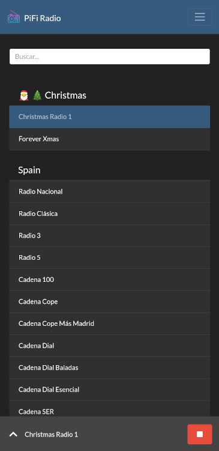
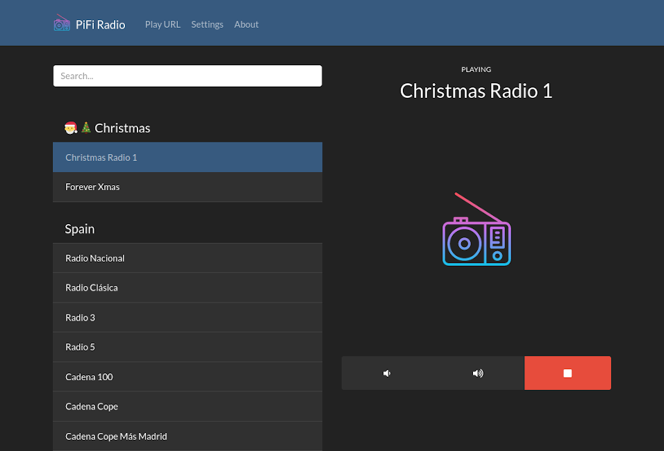
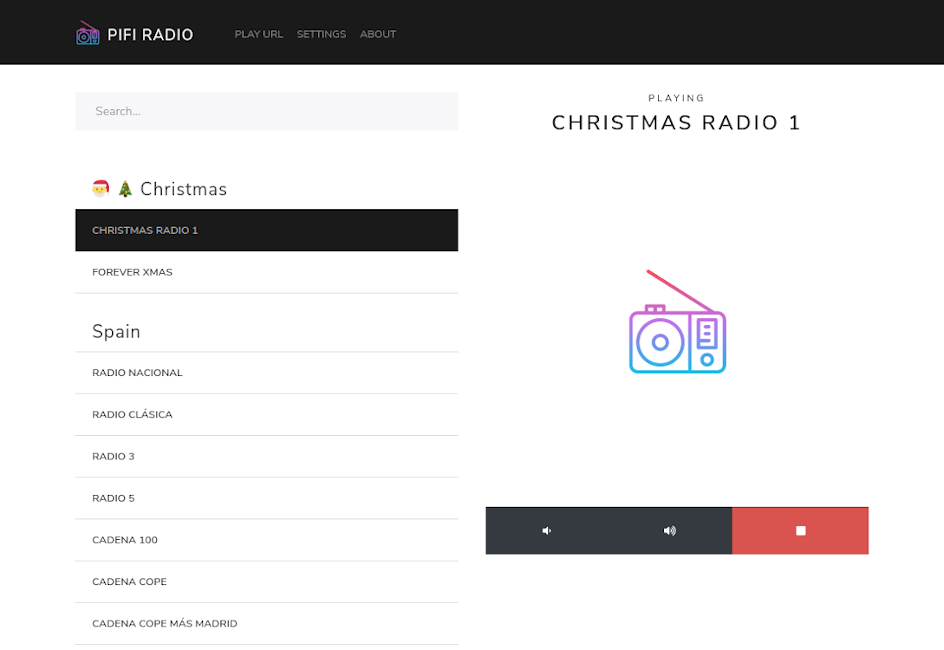

# PiFi Radio

<p align="center">
  
</p>
<p align="center">PiFi Radio: A MPD web client to listen to radio.</p>

## Table of contents

- [Meet PiFi Radio](#meet-pifi-radio)
  - [Some features](#some-features)
  - [Demo](#demo)
- [Installation](#installation)
- [Configuration](#configuration)
  - [List of streams](#list-of-streams)
  - [PiFi configuration](#pifi-configuration)
- [Credits](#credits)
- [License](#license)

## Meet PiFi Radio

PiFi Radio is a MPD web client to listen to radio.

If you have no idea what this means... You install it on a device such as the Raspberry Pi or anything with a speaker. Then, you open your browser from anywhere (e.g. your phone) to control it and listen to your favorite radio stations.

PiFi is an interface for MPD, so it has some advantages compared to other solutions, e.g. bluetooth or AirPlay. One of them is that the playback is completely independent from your phone. So you can continue to use it normally, play a video, lose connection or even turn it off, and your Pi will still continue to play the radio.

[I started this project in early 2017. At that time, I wanted to configure Raspbian so my parents could listen to radio with ease, but couldn't find any good solution to it.](https://rafaelc.org/blog/the-motivation-for-pifi-radio/)

## Some features

- Responsive interface for phones, tablets and desktops.
- Display stations clearly. No URLs or weird names.
- Themes, dark and light.
- Easily search your radios.
- Centralized list of stations. You get the same radios on every device.
- Make some radios to be offered only to certain IPs. A use case for this is if there are tons of stations that only you listen and you don't want to pollute everyone else's list.
- Organize your radios by categories.
- Streaming URLs can be pasted directly from your web browser. Useful if you want to listen to a radio that was not previously added to the list.
- Multi-language.
- Usable by multiple people at the same time.

## Demo







## Installation

While PiFi was imagined for the Pi, it should run on any computer with Ruby and MPD.

Install it with:

```
$ sudo gem install pifi --no-document
```

Place a list of streams at `/etc/pifi/streams.json`:

```
$ sudo mkdir -p /etc/pifi
$ sudo wget https://raw.githubusercontent.com/rccavalcanti/pifi-radio/master/docs/streams.json.sample -O /etc/pifi/streams.json
```

Make sure MPD is running and start PiFi:

```
$ sudo systemctl start mpd
$ pifi
```

For more detailed steps, [check the installation guide](INSTALL.md).

## Configuration

### List of streams

PiFi needs a list of the radios you want to listen. [A example is available here](docs/streams.json.sample).

The list is read by default from `/etc/pifi/streams.json`. You can change this path [creating a configuration file](#pifi-configuration).

To keep it simple, the list of streams is just a JSON file with key-value pairs, where the key is the station name, and the value is the streaming URL. For example:

    {
         "Radio 1": "https://example.com/radio1",
         "Radio 2": "https://example.com/radio"
    }

If you want to arrange the stations in categories, add a pair with the category name as the key and empty value, as shown below. This will add the headers "Talk radio" and "Classical" above each group of stations, [such as "Spain" and "Christmas" in the demo](#demo).

    {
         "Talk radio": "",
         "Radio 1": "https://example.com/radio1",
         "Radio 2": "https://example.com/radio2"

         "Classical": "",
         "Radio 3": "https://example.com/radio3",
         "Radio 4": "https://example.com/radio4"
    }

### PiFi configuration

It's now completely optional to have a configuration file for PiFi. You only need one if you want something different from the defaults.

The path is `/etc/pifi/config.json` and these are the options:

| Key                 | Default                  | Description                                                                                                       |
| ------------------- | ------------------------ | ----------------------------------------------------------------------------------------------------------------- |
| `mpd_host`          | `127.0.0.1`              | MPD host.                                                                                                         |
| `mpd_port`          | `6600`                   | MPD port.                                                                                                         |
| `mpd_password`      | `""` (none)              | MPD password.                                                                                                     |
| `streams_path`      | `/etc/pifi/streams.json` | Path to the JSON file containing the streams.                                                                     |
| `streams_path_priv` | `""` (none)              | Path to JSON file containing additional streams. These will be shown only to the devices listed on `special_ips`. |
| `special_ips`       | `""` (none)              | The IPs of the devices to show additional streams.                                                                |
| `serve_static`      | `true`                   | If we should serve static resources. Set it to `false` if your web server is already doing it.                    |

If you want to change any of these options, download the sample file and edit it to your needs:

```
$ sudo mkdir -p /etc/pifi
$ sudo wget https://raw.githubusercontent.com/rccavalcanti/pifi-radio/master/docs/config.json.sample -O /etc/pifi/config.json
$ sudo -e /etc/pifi/config.json
```

## Usage

PiFi can be run:

- With the `pifi` command. Check `pifi -h` for the options available.
- [If you installed the systemd service](INSTALL.md#running-at-system-boot-and-as-other-user), with `sudo systemctl start pifi`.
- At boot enabling the systemd service with `sudo systemctl enable pifi`.

On your mobile browser, I suggest you add PiFi Radio to your home screen, for easier access.

## Credits

- Translation fr-fr: Francis Chavanon "rimeno"
- Translation nl-nl: Heimen Stoffels "Vistaus"
- Icon made by [iconixar](https://www.flaticon.com/authors/iconixar) from [www.flaticon.com](https://www.flaticon.com/), licensed by [Flaticon Basic License](docs/icon/license.pdf).

## License

Released under [GNU GPL v3](LICENSE).

Copyright 2017-2020 Rafael Cavalcanti <hi@rafaelc.org>
